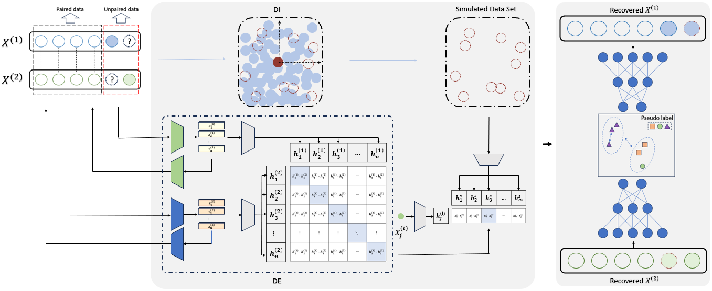

# IMVC-IE
Source codes of the work "Incomplete_Multi-View_Clustering_Via_Inference_and_Evaluation" published in ICASSP 2024.

If you find this repository useful in your research, please cite our work as follows, thanks.
@INPROCEEDINGS{10448378, 
  &nbsp;&nbsp;&nbsp;&nbsp;author={Huang, Binqiang and Huang, Zhijie and Lan, Shoujie and Zheng, Qinghai and Yu, Yuanlong}, 
  &nbsp;&nbsp;&nbsp;&nbsp;booktitle={ICASSP 2024 - 2024 IEEE International Conference on Acoustics, Speech and Signal Processing (ICASSP)},  
  &nbsp;&nbsp;&nbsp;&nbsp;title={Incomplete Multi-View Clustering Via Inference and Evaluation},  
  &nbsp;&nbsp;&nbsp;&nbsp;year={2024}, 
  &nbsp;&nbsp;&nbsp;&nbsp;volume={}, 
  &nbsp;&nbsp;&nbsp;&nbsp;number={}, 
  &nbsp;&nbsp;&nbsp;&nbsp;pages={8180-8184}, 
  &nbsp;&nbsp;&nbsp;&nbsp;keywords={Clustering methods;Signal processing algorithms;Clustering algorithms;Self-supervised learning;Signal processing;Benchmark testing;Excavation;Incomplete multi-view clustering;missing data inference;data evaluation}, 
  &nbsp;&nbsp;&nbsp;&nbsp;doi={10.1109/ICASSP48485.2024.10448378} 
} 

Email: zhengqinghai@fzu.edu.cn; qhxjtu@163.com
